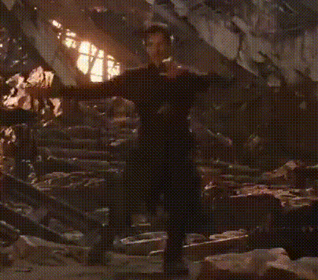

# Dr. Strange in Ukraine

## Reason for this project

This project combines technology and help for Ukraine. Since 2014 there has been an ongoing war between ruzzia and Ukraine, and on the 24th of February 2022, ruzzia started a full invasion of Ukraine. With the help of soldiers who courageously fight for Ukraine, Ukraine's friends, such as USA, Great Britain and so on and so forth, who supply Ukraine with the weaponry, and caring people, who send money to the army, Ukraine has been successfuly fighting the occupants and showing them where their place is: in the swamps and dirt where they come from.

But more and more people forget about the ongoing war. I have friends(from abroad) who ask me "Is the war still going on?" The media now broadcasts only the big events(the ones THEY consider big). I think that this is wrong. People should be aware of what is happening in Ukraine.

And that is why I made this kind of game where you act as Doctor Strange from marvel universe to go from the Ukraine as it was before the war to Ukraine, that it is now, to Ukraine that has been defending its territories for over 9 years, to Ukraine the part of which was taken in so many ways, and in some ways forever. There is a donate button and a share button. I want you, the reader to help Ukraine, to share this page and to donate money to Ukraine. It is as much your fight as it is theirs. It is a fight between evil and good, between dark and light, between slavery and freedom, between old and new. It is a fight between russia and Ukraine. You can stand by and watch the fight, or you can take part in it, and help Ukraine win.

## How to use this website

Once you open up a page, it will show you a picture of a city in Ukraine as it was before the war, a slot with video and some general information. If you have seen doctor strange open portals, you know that he does it like this: 

To open a portal to Ukraine now, you just have to replicate his movements, like this: . Your fingers' position will be shown with the purplish circles and the portal opens completely once it opens enough(you can see the progress in the bottom right corner). I hope you will do the right thing: support Ukraine and donate money. And if you are russian: either donate money, or fuck off.

for any question write in [telegram](https://t.me/fubim)
